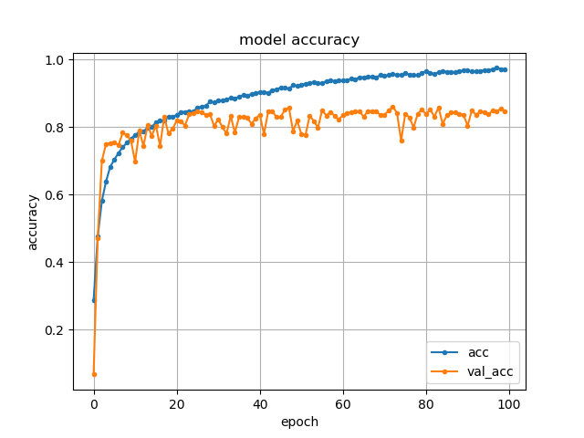
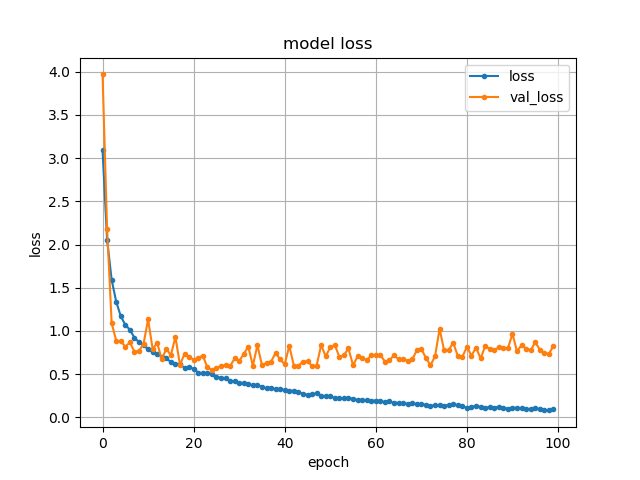

# (Any Number Of) Point(s)Net

## About

**Have you ever wished that you could train PointNet with data of one size, and use a different amount of points at inference?**

By implementing PointNet in a way which is invariant to the input size, this repository is home to a useful implementation of [PointNet](https://github.com/charlesq34/pointnet) which permits use of any number of points at inference.

This code is based on the Keras/TF implementations available [here](https://github.com/TianzhongSong/PointNet-Keras) and [here](https://github.com/garyli1019/pointnet-keras).

### Requirements

`python>=3.6`, `keras`, `tensorflow>=2.0.0`, `numpy`, `matplotlib`, `h5py`, and `sklearn` for computation of evaluation metrics in `predict.py`.

This network contains the code for the PointNet classification network on point clouds sampled from 3D shapes in the ModelNet40 dataset.

## Usage

### Preparing Data

If you'd like to train your own model(s) - then please first, download the [ModelNet40](https://shapenet.cs.stanford.edu/media/modelnet40_ply_hdf5_2048.zip) dataset. Put all traning `.h5` files under `'./ModelNet40/train/'` folder, all testing h5 files under `'./ModelNet40/test/'` folder and run:

    python prepareData.py

### Training

The data loader also augments the data with rotation and jitter, and can also be modified to randomly resample the points (originally of size 2048x3) to any number of points smaller than this. Simply change the number of points argument in your call to `train()` before running:

    python train.py

Pre-trained models (100 epochs, LR = 0.0001, Batch Size = 32, Input Size = [{2048, 1024, 512, 256}x3]) are available in the results folder.

Training times with fewer points are faster. Approximate training times are below:

| Number of Points in Training | Time to 100 Epochs |
|------------------------------|--------------------|
| 2048                         | 120 minutes        |
| 1024                         | 60 minutes         |
| 512                          | 35 minutes         |
| 256                          | 25 minutes         |

### Results

An initial run of the network, a simplified version of original implementation without LR scheduling or other tuning, yields a validation accuracy of 84% (compared to 89% in the original paper) after 100 epochs. It is clear that increased regularization or LR scheduling may improve these results and this may be implemented in the future.

When trained with 2048 points:

Other results (training at 1024, 512, 256) are available in the results folder.

### Predict

This is where the utility of this implementation comes into view; the original implementation and most (if not all) other implementations do not accept variable size of input points at training or inference. This implementation achieves the latter as can be seen through the use of weight loading in `predict.py`. To run:

    python predict.py

Presently, `predict.py` is implemented to resample and predict on the points from the ModelNet40 dataset at 2048 (for baseline performance), 1024, 512, and 256 points.

These different thresholds of points yield the following accuracies:

| Number of Points in Training | Number of Points at Inference  | Accuracy   |
|------------------------------|--------------------------------|------------|
| **2048**                     | **2048**                       | **84.49%** |
| 2048                         | 1024                           | 84.25%     |
| 2048                         | 512                            | 82.18%     |
| 2048                         | 256                            | 72.44%     |
| 1024                         | 2048                           | 86.77%     |
| **1024**                     | **1024**                       | **87.26%** |
| 1024                         | 512                            | 85.92%     |
| 1024                         | 256                            | 80.28%     |
| 512                          | 2048                           | 85.43%     |
| 512                          | 1024                           | 85.39%     |
| **512**                      | **512**                        | **84.78%** |
| 512                          | 256                            | 80.89%     |
| 256                          | 2048                           | 84.21%     |
| 256                          | 1024                           | 85.02%     |
| 256                          | 512                            | 86.24%     |
| **256**                      | **256**                        | **85.92%** |

## So what?

**I'm glad you asked!**

If we look at the results above, we can see that (save for Train on 2048, Predict on 256) the generalizability of the weights in PointNet are demonstrated when training and predicting on different numbers of points. This shows that we may be able to train for such types of networks, where the number of weights are constant despite different size inputs, with smaller inputs and therefore take less time and/or memory and still achieve comparable results.
